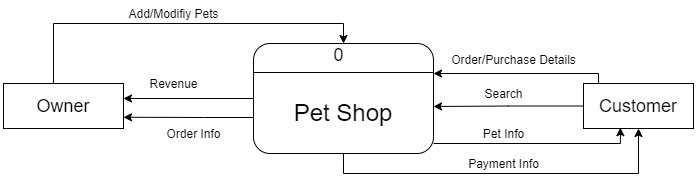
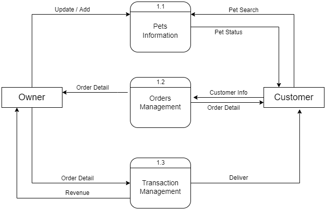
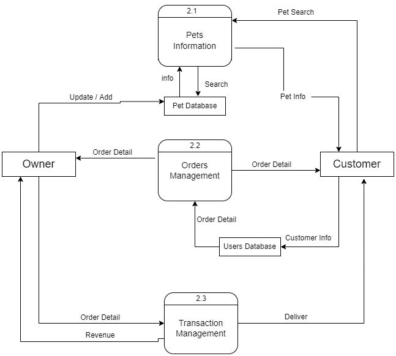
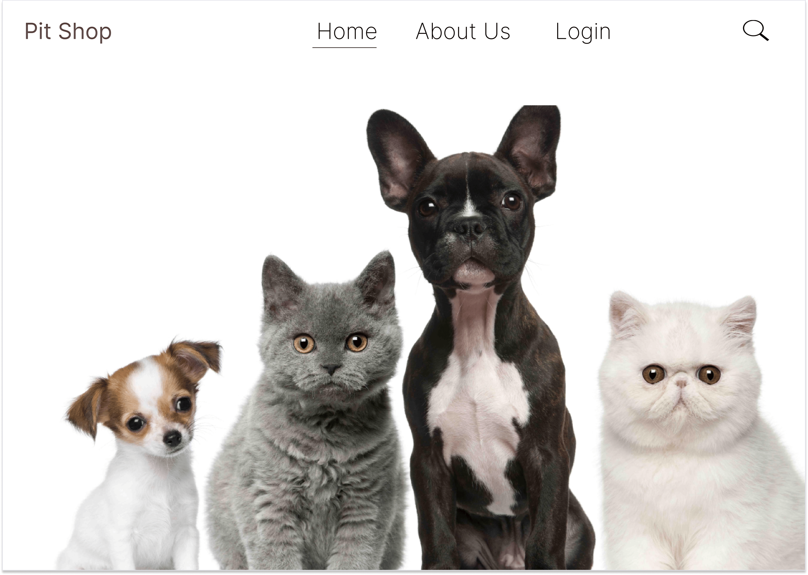
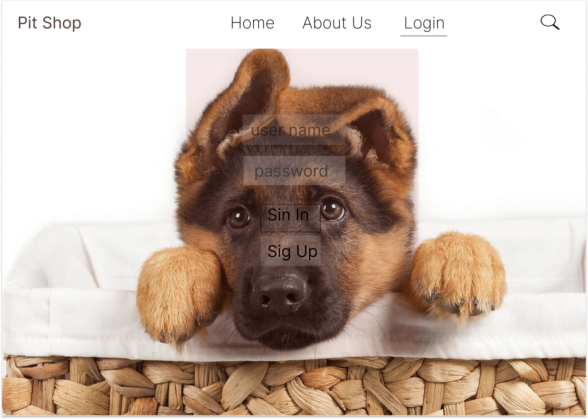
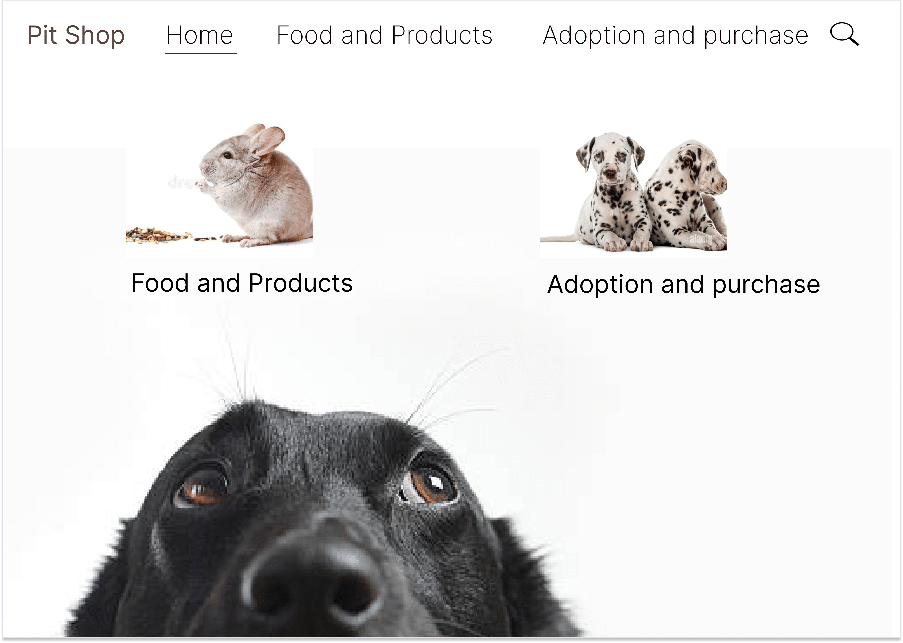
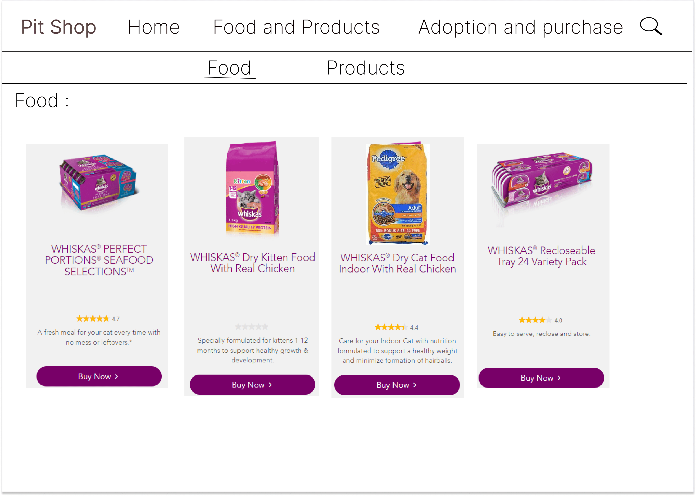
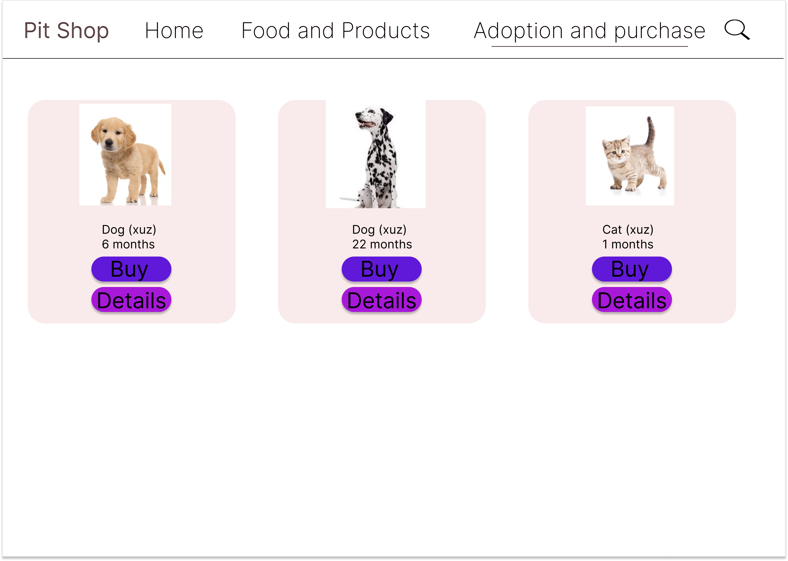
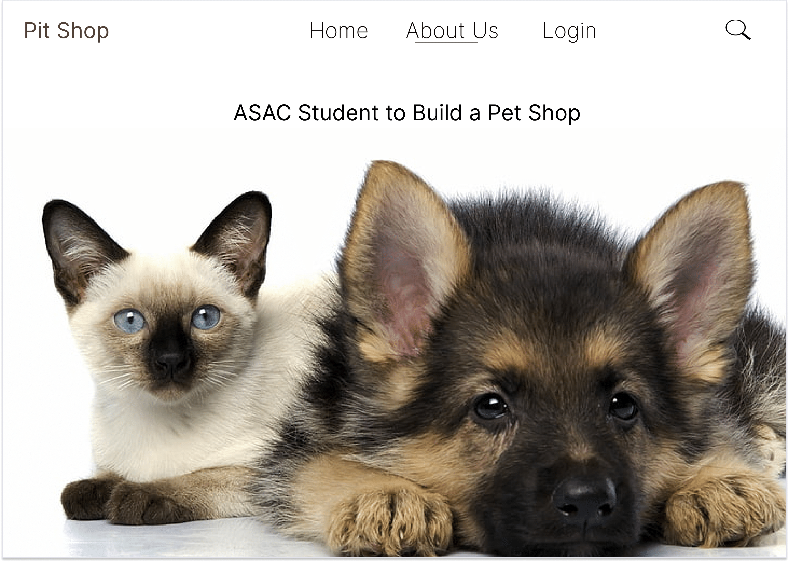

# Pet Shop

#|Title
---|---
1| [requirment](#requirment)
2| [user stories](#user-stories)
3| [domain modeling](#domain-modeling)
4| [wireframes](#wireframes)

## Requirment 
You can find Requirments [HERE](Requirments.md)

## User Stories

As a bet shop owner:

1. I want to have the ability to add and remove pets
2. and i want to have a custom interface to add my product and pets
3. I want to have the ability to add some animal product like food clothes and toys
4. and the ability to create an account and log in
5. and the ability to add save and update the pets medical history

As a customer

1. I want an easy way to find a pet
2. and the ability to know the pets medical history
3. and the ability to buy some different foods and treats for my pets
4. and the ability to create an account and log in
5. and the ability to adapt the bet

## Domain Modeling

## Context Diagram (DFD level 0)

---

## DFD level 1

---

## DFD level 2

---

---

## Wireframes

### Home

---

### Log in

---

### Categories

---

### Products

---

### Animals

---

### About us

---

