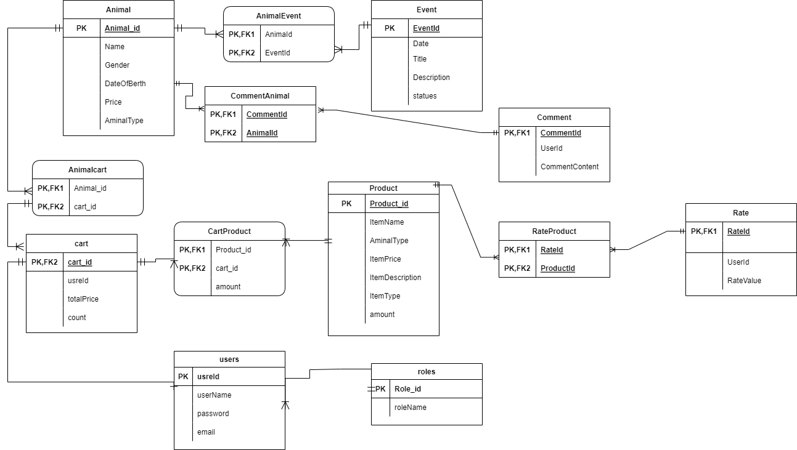

# Pet Shop Software Requirments

#|Title
---|---
1| [project vision](#project-vision)
2| [functional requirements](#functional-requirements)
3| [non-functional requirements](#non-functional-requirements)
4| [ER-Diagram](#er-diagram)

### Project Vision

Our vision is to offer a place that contains everything related to pets online so that everyone can benefit from our services.

**What pain point does this project solve?**

- Provide a single location (web app) where a variety of pets can be purchased and adopted.
- make the procedure of obtaining animal health certificates and passports easier

**Why should you care about our product?**

Our website saves the user a lot of time and effort when using our services compared by the traditional way of getting the same services form another provider.

**In Scope**
- The app will provide the user with all information he/she needs about the pets they want
- The app will allow the user to sell or adopt any pet they want
- The user will have the ability to anything related to his/her pet wither its nutrition products, toys etc… 
- The user can get health certificates and passports for the pets available on the web app.

**Out Scope**
- The app will not have a version for IOS

**MVP Functionality**

Our web app is built around three primary features. It allows the user to add a pet for adoption or sell a pet, as well as provide nutrition and other pet items. Finally, the app allows you to obtain a record containing the pet's history.

**Stretch goals?**
We aim to assign roles to owners and users in the 2nd version of our app, as well as the option to arrange an appointment for a veterinarian to check on the users' pets.

### Functional Requirements
- The users can log in /Register
- A user can update their profile information
- An owner can create and delete pet items in shop section and pet in the animal section
- have a warning if the one of item is less than a specific amount in shop section
- the age of the animal should be in months
- every order moves to the basket before buying it
- the owner can add / delete notes in health/visa record section for each animal
- the user can search in products (pet/pet-item) before buying it (add it to the basket)

### Non-Functional Requirements
- Security
- Usability
- Testability
- ....

### ER Diagram
